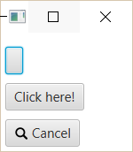
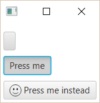
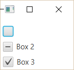
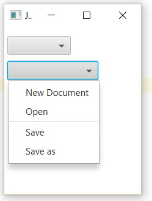
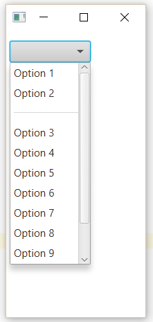
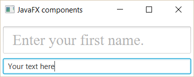
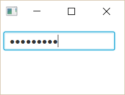
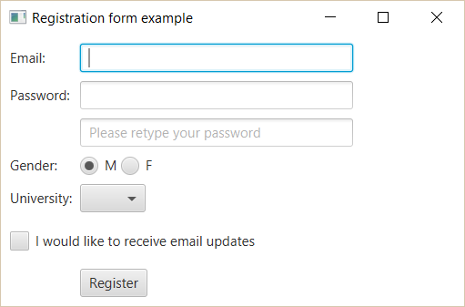

===================
JavaFX: komponendid
===================

Kasutajaliidesed koosnevad erinevatest komponentidest nagu tekstiväljad, nupud jne. Vaatame lähemalt põhilisi komponente, mida JavaFX võimaldab kasutada.

Label
=====

**Label** võimaldab kuvada teksti. Erinevalt tekstiväljadest pole Label kasutaja poolt otse muudetav.

.. code-block:: java

    // Tühi Label
    Label label1 = new Label();
    // Label, mis sisaldab teksti
    Label label2 = new Label("Hello World");
    // Label koos ikooniga
    Image image = new Image(getClass().getResourceAsStream("search.png"));
    Label label3 = new Label("Search", new ImageView(image));
    
Tulemus:

.. image:: images/Labels.PNG

Kasulikud meetodid
------------------

.. code-block:: java

    // Teksti muutmine
    label1.setText("Hello World");
    // Värvi muutmine
    label1.setTextFill(Color.BLUE);
    // Kirjatüübi muutmine
    label1.setFont(new Font("Arial", 25));
    // Teksti murdmine, kui see on liiga pikk
    label1.setWrapText(true);
    // Ikooni või pildi lisamine
    Image img = new Image(getClass().getResourceAsStream("search.png"));
    label1.setGraphic(new ImageView(img));
    // Pildi ja teksti vahelise tühimiku muutmine
    label1.setGraphicTextGap(5.5);
    // Pildi asukoha valimine teksti suhtes
    label1.setContentDisplay(ContentDisplay.TOP);

Button
======

**Button** ehk nupp on komponent, mille vajutamisel kasutaja poolt peaks käivituma mingi funktsioon.

.. code-block:: java

    Button button1 = new Button();
    Button button2 = new Button("Click here!");

    Image imageSearch = new Image(getClass().getResourceAsStream("search.png"));
    Button button3 = new Button("Cancel", new ImageView(imageSearch));

Tulemus:

Nupuvajutuse töötlemine
-----------------------

.. code-block:: java

    button2.setOnAction((ActionEvent e) -> {
        button1.setText("Text!");
    });

Button klass sisaldab samuti kõiki meetodeid, mis olid eelnevalt välja toodud Label klassi juures.

Toggle button
=============

**Toggle button** ehk tumblernupp on nupp, millel on kaks olekut –  ta võib olla valitud või mitte. Selliseid nuppe saab lisada gruppidesse nii, et igas grupis võib korraga valitud olla maksimaalselt üks nupp.

.. code-block:: java

    ToggleButton tb1 = new ToggleButton();
    ToggleButton tb2 = new ToggleButton("Press me");

    Image image = new Image(getClass().getResourceAsStream("icon.png"));
    ToggleButton tb3 = new ToggleButton("Press me instead", new ImageView(image));

Tulemus:

Ka tumblernuppude jaoks kehtivad Labeli juures kirjeldatud meetodid.

Grupi loomine
-------------

.. code-block:: java

    final ToggleGroup group = new ToggleGroup();

    ToggleButton tb1 = new ToggleButton("Easy");
    tb1.setToggleGroup(group);
    tb1.setSelected(true);                         // Kui tahame, et üks oleks vaikimisi valitud

    ToggleButton tb2 = new ToggleButton("Medium");
    tb2.setToggleGroup(group);

    ToggleButton tb3 = new ToggleButton("Hard");
    tb3.setToggleGroup(group);

Nuppude grupi puhul juhtida programmi tööd vastavalt sellele, milline nupp on hetkel valitud:

(Kasutamise näide)

Radio button
============

Raadionupud sarnanevad oma käitumiselt tumblernuppudele, kuna neid kasutatakse samuti grupina, kus kasutaja peab valima vaid ühe. Erinevalt tumblernupust peab üks raadionupp grupis alati valitud olema.

.. code-block:: java

    RadioButton rb1 = new RadioButton();
    RadioButton rb2 = new RadioButton("Select me");

Tulemus:

.. image:: images/Radiobutton.PNG

Grupeerimine ja valiku töötlemine käib sarnaselt eelnevale Toggle Group objekti kaudu. Kasutada saab kõiki eelpoolnimetatud meetodeid. Raadionupul pole konstruktorit, millega saab pildi lisada, kuid setGraphic meetodiga saab seda sellegipoolest teha.

Checkbox
========

**Checkbox** ehk märkeruut võimaldab üheaegselt valida rohkem kui ühe valiku grupis.

.. code-block:: java

    CheckBox cb1 = new CheckBox();
    CheckBox cb2 = new CheckBox("Box 2");

Checkboxi väärtus võib olla määratud või määramata. Selleks, et väärtus oleks algul määramata, tuleb kasutata meetodit **setIndeterminate**.

.. code-block:: java

    CheckBox cb3 = new CheckBox("Box 3");

    cb1.setAllowIndeterminate(true); // võimaldab kasutajal valida "indeterminate" väärtuse
    cb1.setSelected(false);          // pole valitud
    cb2.setIndeterminate(true);      // määramata
    cb3.setSelected(true);           // on valitud

Tulemus:

(Kasutamise näide koos nupuga)

Choice box
==========

**Choice box** on lihtne *drop-down* valikute nimekiri. Lisada saab ainult teksti ning element on mõeldud kasutamiseks väiksema arvu valikute korral.

.. code-block:: java

    ChoiceBox cb = new ChoiceBox();
    cb.setItems(FXCollections.observableArrayList(
        "New Document",
        "Open ",
        new Separator(),                            // Valikuline element gruppide eraldamiseks
        "Save",
        "Save as")
    );
    // Alternatiivne viis elemente lisada
    cb.getItems().addAll(
        "Option 1",
        "Option 2",
        "Option 3"
    );

Tulemus:

(kasutamise näide)

Combobox
========

**Combobox** on samuti valikukast, kuid on pikkade nimekirjade puhul mõistlikum kui choice box. Lisaks on võimalik seadistada Combobox nii, et kasutaja saab ise väärtusi lisada.

.. code-block:: java

    final ComboBox comboBox = new ComboBox();
    comboBox.getItems().addAll(
            "Option 1",
            "Option 2",
            new Separator(),
            "Option 3"
    );

Tulemus 11 elemendi puhul:

(Väärtuste lisamise näide + kasutamise näide)

Text field
==========

Tekstiväli võimaldab küsida kasutajalt sisendit tekstina.

.. code-block:: java

    TextField textField = new TextField();
    // Ettemääratud sisuga tekstiväli. Seda teksti loetakse kasutaja sisendiks, kui ta seda ei muuda.
    TextField textField2 = new TextField("Your text here");

Kasulikud meetodid
------------------

.. code-block:: java

    // Sisendi lugemine
    String userText = textField.getText();
    // Teksti muutmine
    textField.setText("Your text here");
    // Välja tühjendamine
    textField.clear();
    // Kirjatüübi muutmine
    textField.setFont("Arial", 30);
    // Juhendava teksti lisamine. Seda teksti ei loeta kui kasutaja sisendit.
    textField.setPromptText("Enter your first name.");

Tulemus:

Password field
==============

Parooliväli erineb tavalisest tekstiväljast selle poolest, et tema sisu on varjatud. Kui me soovime enne parooli sisestamist kuvada mingit teksti, tuleb kindlasti kasutada meetodit **setPromptText**, kuna setText sisestab algteksti samuti varjatud kujul.

.. code-block:: java

    PasswordField passwordField = new PasswordField();
    passwordField.setPromptText("Your password");

Tulemus:

Kõik tekstivälja meetodid töötavad samamoodi ka paroolivälja puhul.

Kasutajaliidese näidis (registreerimisvorm)
===========================================

.. code-block:: java

    import javafx.application.Application;
    import javafx.event.ActionEvent;
    import javafx.geometry.Insets;
    import javafx.scene.Group;
    import javafx.scene.Node;
    import javafx.scene.Scene;
    import javafx.scene.control.*;
    import javafx.scene.layout.GridPane;
    import javafx.scene.layout.Region;
    import javafx.stage.Stage;

    public class Main extends Application {
        public static void main(String[] args) {
            launch(args);
        }

        @Override
        public void start(Stage stage) {
            Group root = new Group();
            stage.setTitle("Registration form example");
            Scene scene = new Scene(root);

            TextField textFieldEmail = new TextField();
            PasswordField passwordField1 = new PasswordField();
            PasswordField passwordField2 = new PasswordField();
            passwordField2.setPromptText("Please retype your password");
            RadioButton radioButtonMale = new RadioButton("M");
            RadioButton radioButtonFemale = new RadioButton("F");
            ToggleGroup genderToggleGroup = new ToggleGroup();
            radioButtonFemale.setToggleGroup(genderToggleGroup);
            radioButtonMale.setToggleGroup(genderToggleGroup);
            radioButtonMale.setSelected(true);
            ChoiceBox choiceBoxUniversity = new ChoiceBox();
            choiceBoxUniversity.getItems().addAll("TTÜ", "TLÜ", "TÜ");
            Button registerButton = new Button("Register");

            CheckBox checkBoxEmailUpdates = new CheckBox("I would like to receive email updates");
            checkBoxEmailUpdates.setWrapText(true);

            GridPane grid = new GridPane();
            grid.setVgap(10);
            grid.setHgap(4);
            grid.setPadding(new Insets(10, 10, 10, 10));

            grid.add(new Label("Email: "), 0, 0);
            grid.add(textFieldEmail, 1, 0, 2, 1);
            grid.add(new Label("Password: "), 0, 1);
            grid.add(passwordField1, 1, 1, 2, 1);
            grid.add(passwordField2, 1, 2, 2, 1);
            grid.add(new Label("Gender: "), 0, 3);
            grid.add(radioButtonMale, 1, 3);
            grid.add(radioButtonFemale, 2, 3);
            grid.add(new Label("University: "), 0, 4);
            grid.add(choiceBoxUniversity, 1, 4, 2, 1);
            grid.add(checkBoxEmailUpdates, 0, 5, 3, 1);
            grid.add(registerButton, 1, 6, 2, 1);

            registerButton.setOnAction((ActionEvent e) -> {
                String userPassword = passwordField1.getText();
                if (userPassword.equals(passwordField2.getText())) {
                    String userEmail = textFieldEmail.getText();
                    String userUniversity = choiceBoxUniversity.valueProperty().getValue().toString();
                    String userGender;
                    String emailsAllowed;
                    if (radioButtonMale.isSelected()) {
                        userGender = "Male";
                    } else {
                        userGender = "Female";
                    }
                    if (checkBoxEmailUpdates.isSelected()) {
                        emailsAllowed = "emails allowed";
                    } else {
                        emailsAllowed = "emails not allowed";
                    }
                    System.out.println("User " + userEmail + " registered with password "
                            + userPassword + " (" + userGender + ", " + userUniversity + ", " + emailsAllowed + ")");
                } else {
                    grid.add(new Label("Passwords do not match!"), 0, 7, 3, 1);
                    System.out.println("Registration failed: passwords not equal");
                }
            });

            for (Node element: grid.getChildren()) {
                if (element instanceof TextField) {
                    ((Region) element).setMinWidth(300.0);
                }
            }

            root.getChildren().add(grid);
            stage.setScene(scene);
            stage.show();
        }
    }
