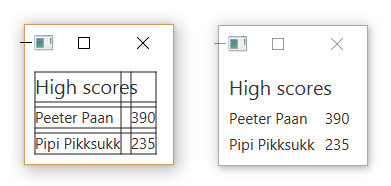
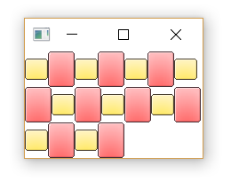
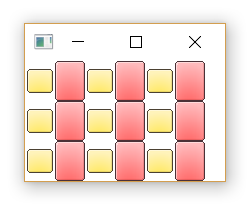
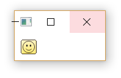

==============
JavaFX: Layout
==============

**Layout** konteinerid ehk paanid (*panes*) võimaldavad komponente (scene graphi) sees erineval viisil paigutada. Soovitud struktuuri saamiseks võib erinevaid paane üksteise sisse panna. Kui akna suurust muudetakse, muudavad paanid automaatselt enda komponentide mõõtmeid ja paiknemist.

HBox, VBox
==========

**Hbox** ja **VBox** võimaldavad komponente paigutada üksteise kõrvale (Hbox) või üksteise alla (VBox).

.. code-block:: java

    Label sudokuLabel = new Label("Sudoku");
    Button startButton = new Button("Start");

    startButton.setPrefWidth(150);
    sudokuLabel.setFont(new Font("SegoeUI", 20));

    HBox hbox = new HBox();
    // Hbox hbox = new HBox(sudokuLabel, startButton);
    hbox.getChildren().addAll(sudokuLabel, startButton);

    hbox.setPadding(new Insets(10, 10, 10, 10));
    hbox.setSpacing(15);

.. image:: images/Hbox.PNG

.. code-block:: java

    Label crosswordsLabel = new Label("Crosswords");
    Label memoryLabel = new Label("Memory");

    crosswordsLabel.setFont(new Font("SegoeUI", 15));
    memoryLabel.setFont(new Font("SegoeUI", 15));

    VBox vbox = new VBox(crosswordsLabel, memoryLabel);

    vbox.setPadding(new Insets(10, 10, 10, 10));
    vbox.setPrefWidth(150);
    vbox.setSpacing(5);

    vbox.setAlignment(Pos.CENTER);

    group.getChildren().add(vbox);

.. image:: images/Vbox.PNG

GridPane
========

**GridPane** loob ruudustiku, mille ruutudesse komponente paigutatakse. Meetodi **setGridLinesVisible** abil saab kuvada abijooni, mis aitavad hinnata, kas ruudustiku abil üles ehitatud paigutus näeb korrektne välja.

.. code-block:: java

    Label highScoreLabel = new Label("High scores");
    highScoreLabel.setFont(new Font("SegoeUI", 20));

    HashMap<String, Integer> times = new HashMap<>();
    times.put("Peeter Paan", 390);
    times.put("Pipi Pikksukk", 235);

    GridPane gridPane = new GridPane();
    gridPane.setPadding(new Insets(10, 10, 10, 10));
    gridPane.setVgap(5);
    gridPane.setHgap(10);

    gridPane.add(highScoreLabel, 0, 0, 2, 1);

    int row = 1;
    for (String name: times.keySet()) {
        gridPane.add(new Label(name), 0, row);
        String scoreString = times.get(name).toString();
        gridPane.add(new Label(scoreString), 1, row);
        row++;
    }

FlowPane
========

**FlowPane** sarnaneb Hbox'i ja VBox'iga – ka seal paigutatakse elemente järjestikku kas horisontaalselt või vertikaalselt sõltuvalt paani orientatsioonist. Vahe on selles, et kui elemendid ei mahu kõik järjestikku, jätkab FlowPane nende paigutamist uuelt realt (või uuest veerust).

.. code-block:: java

    FlowPane flowPane = new FlowPane();
    flowPane.setPrefWidth(200);
    // Add some images
    for (int i = 0; i < 9; i++) {
        ImageView img = new ImageView(new Image(getClass().getResourceAsStream("smallyellowbox.png")));
        flowPane.getChildren().add(img);
        ImageView img2 = new ImageView(new Image(getClass().getResourceAsStream("bigredbox.png")));
        flowPane.getChildren().add(img2);
    }

TilePane
========

**TilePane** toimib samamoodi nagu FlowPane, kuid elemendid paigutatakse ruudustikku, kus kõik ruudud on võrdse suurusega. Ruudu suurus on vaikimisi suurima elemendi suurus, kuid seda saab eraldi määrata ka meetodi **setPrefTileWidth** abil.

.. code-block:: java

    TilePane tilePane = new TilePane();

   //tilePane.setPrefTileHeight(50);
   //tilePane.setPrefTileWidth(50);

    tilePane.setPrefWidth(200);

    for (int i = 0; i < 9; i++) {
        ImageView img = new ImageView(new Image(getClass().getResourceAsStream("smallyellowbox.png")));
        tilePane.getChildren().add(img);
        ImageView img2 = new ImageView(new Image(getClass().getResourceAsStream("bigredbox.png")));
        tilePane.getChildren().add(img2);
    }

   // tilePane.setPrefColumns(3);

StackPane
=========

**StackPane** paigutab kõik komponendid üksteise peale. Nii on võimalik näiteks kujunditest ja tekstist kokku panna ikoone.

.. code-block:: java

    StackPane stackPane = new StackPane();
    // Smiley icon
    ImageView icon = new ImageView(new Image(getClass().getResourceAsStream("icon.png")));
    // Use yellow box image as the background
    ImageView iconBackground = new ImageView(new Image(getClass().getResourceAsStream("smallyellowbox.png")));
    // Add background first because otherwise the smiley will be hidden underneath it
    stackPane.getChildren().addAll(iconBackground, icon);
    stackPane.setPadding(new Insets(10, 10, 10, 10));

    group.getChildren().addAll(stackPane);

AnchorPane
==========

**AnchorPane** võimaldab komponente enda keskele, mõne serva või nurga külge ankurdada.

.. code-block:: java

    Label timeLabel = new Label("00:00");
    timeLabel.setFont(new Font("SegoeUI", 12));

    AnchorPane anchorPane = new AnchorPane();
    anchorPane.setPrefSize(300, 200);
    anchorPane.getChildren().add(timeLabel);

    AnchorPane.setBottomAnchor(timeLabel, 8.0);
    AnchorPane.setRightAnchor(timeLabel, 8.0);

.. image:: images/Anchorpane.PNG

BorderPane
==========

**BorderPane** jaotab akna viieks piirkonnaks, kuhu komponente saab paigutada:

.. image:: images/Borderpane.PNG

Lisada võib nii komponente (Label, Button jne) kui ka Layout objekte.

Kasutame BorderPane'i, et ühendada mõned eelnevalt loodud Layout'id ühtseks kasutajaliideseks.

.. image:: images/Smileysweeper.PNG

.. code-block:: java

    import javafx.application.Application;
    import javafx.event.ActionEvent;
    import javafx.geometry.Insets;
    import javafx.geometry.Pos;
    import javafx.scene.Group;
    import javafx.scene.Node;
    import javafx.scene.Scene;
    import javafx.scene.control.Button;
    import javafx.scene.control.Label;
    import javafx.scene.image.Image;
    import javafx.scene.image.ImageView;
    import javafx.scene.layout.*;
    import javafx.scene.text.Font;
    import javafx.stage.Stage;

    import java.util.HashMap;

    public class LayoutExample extends Application {
        public static void main(String[] args) {
            launch(args);
        }

        @Override
        public void start(Stage stage) throws Exception {
            stage.setTitle("Layout example");
            // Create the scene with a BorderPane layout.
            BorderPane borderPane = new BorderPane();
            Scene scene = new Scene(borderPane);
            // Create some panes.
            HBox header = createHBox();
            VBox sidebar = createVBox();
            TilePane tiles = createTilePane();
            AnchorPane footer = createAnchorPane();
            // Add panes to the BorderPane.
            borderPane.setTop(header);
            borderPane.setLeft(sidebar);
            borderPane.setCenter(tiles);
            borderPane.setRight(footer);

            stage.setScene(scene);
            stage.show();
        }

        private GridPane createGridPane() {
            // Create title label.
            Label highScoreLabel = new Label("High scores");
            highScoreLabel.setFont(new Font("SegoeUI", 20));
            // Create the grid pane.
            GridPane gridPane = new GridPane();
            gridPane.setPadding(new Insets(10, 10, 10, 10));
            gridPane.setVgap(5); // Vertical gap between components
            gridPane.setHgap(10); // Horizontal gap between components
            // Add the label to the grid.
            gridPane.add(highScoreLabel, 0, 0, 2, 1);
            // Create a map of players and their scores
            HashMap<String, Integer> times = new HashMap<>();
            times.put("Peeter Paan", 390);
            times.put("Pipi Pikksukk", 235);
            // Add the scores to the grid as labels
            int row = 1;
            for (String name: times.keySet()) {
                gridPane.add(new Label(name), 0, row);
                String scoreString = times.get(name).toString();
                gridPane.add(new Label(scoreString), 1, row);
                row++;
            }
            // Uncomment next line for debugging purposes only.
            // gridPane.setGridLinesVisible(true);
            return gridPane;
        }

        private AnchorPane createAnchorPane() {
            // Create a label for showing the time passed since start.
            Label timeLabel = new Label("00:00");
            timeLabel.setFont(new Font("SegoeUI", 12));
            // Create a high score table.
            GridPane highscores = createGridPane();
            // Add the components to the pane.
            AnchorPane anchorPane = new AnchorPane();
            anchorPane.getChildren().addAll(timeLabel, highscores);
            // Change the background color of the pane.
            anchorPane.setStyle("-fx-background-color: #eeeeee;");
            // Add anchors to keep elements in place.
            AnchorPane.setLeftAnchor(highscores, 5.0);
            AnchorPane.setTopAnchor(highscores, 5.0);
            AnchorPane.setBottomAnchor(timeLabel, 8.0);
            AnchorPane.setRightAnchor(timeLabel, 8.0);

            return anchorPane;
        }

        private HBox createHBox() {
            // Create the title label and a start button.
            Label smileySweeperLabel = new Label("SmileySweeper");
            smileySweeperLabel.setFont(new Font("SegoeUI", 20));
            Button startButton = new Button("Start");
            startButton.setPrefWidth(150);
            // Create the HBox and add components.
            HBox hbox = new HBox();
            hbox.setStyle("-fx-background-color: #dddddd;");
            hbox.getChildren().addAll(smileySweeperLabel, startButton);
            // Add some padding and spacing for a better look.
            hbox.setPadding(new Insets(10, 10, 10, 10));
            hbox.setSpacing(15);

            return hbox;
        }

        private VBox createVBox() {
            // Create some labels with names of possible games.
            Label crosswordsLabel = new Label("Crosswords");
            Label memoryLabel = new Label("Memory");
            Label sudokuLabel = new Label("Sudoku");
            // Create vbox and add labels.
            VBox vbox = new VBox(crosswordsLabel, memoryLabel, sudokuLabel);
            vbox.setStyle("-fx-background-color: #eeeeee;");
            // Change font for all labels.
            Font gameLabelFont = new Font("SegoeUI", 15);
            for (Node child: vbox.getChildren()) {
                Label label = (Label) child;
                label.setFont(gameLabelFont);
            }
            // Add some space
            vbox.setPadding(new Insets(10, 10, 10, 10));
            vbox.setSpacing(5);
            // Position all children at the top center of the layout.
            vbox.setAlignment(Pos.TOP_CENTER);

            return vbox;
        }

        private TilePane createTilePane() {
            TilePane tilePane = new TilePane();
            // Create 9x9 tiles and add them to the pane.
            for (int i = 0; i < 81; i++) {
                // Use StackPanes as tiles
                StackPane tile = createStackPane();
                // If the tile is clicked, show or hide the smiley image.
                ImageView smiley = (ImageView) tile.getChildren().get(1);
                smiley.setVisible(false); // Hidden by default
                tile.setOnMouseClicked(e -> {
                    // The smiley is the second element in the StackPane
                    if (smiley.isVisible()) {
                        smiley.setVisible(false);
                    } else {
                        smiley.setVisible(true);
                    }
                });
                tilePane.getChildren().add(tile);
            }
            // Arrange them in a 9x9 grid in the center of its container.
            tilePane.setPrefColumns(9);
            tilePane.setPadding(new Insets(20, 20, 20, 20));

            return tilePane;
        }

        private StackPane createStackPane() {
            // Create the StackPane and some images.
            StackPane stackPane = new StackPane();
            ImageView icon = new ImageView(new Image(getClass().getResourceAsStream("icon.png")));
            ImageView iconBackground = new ImageView(new Image(getClass().getResourceAsStream("smallyellowbox.png")));
            // Add background first because otherwise the smiley will be hidden underneath it
            stackPane.getChildren().addAll(iconBackground, icon);

            return stackPane;
        }

    }