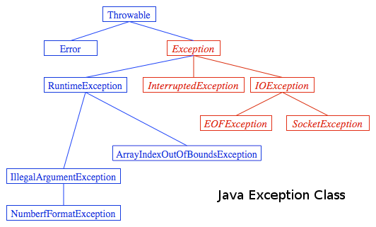

=====
Erind
=====

Programmi üks oluline näitaja on selle töökindlus. Hea programm on see, mis suudab erinevates olukordades tööd võimaluse korral jätkata. Üks võimalus töökindluse suurendamiseks on proovida ennetada vigu. Selleks tuleb kõiki võimalikke probleemseid olukordi ette näha ja vastavad kontrollid oma koodi lisada. Aga kõiki vigu pole alati võimalik ennetada. Samuti võib liigne ülekontrollimine koodi segasemaks teha.

Toome ühe lihtsa näite. Järgnev meetod :code:`getElement` saab argumentideks ühe täisarvude massiivi ja sõne. Saadud sõne teisendatakse täisarvuks, mida omakorda kasutatakse massiivi indeksina. Antud koodis ühtegi kontrolli ei teostata. 

.. code-block:: java

    public static int getElement(int[] array, String userInput) {
        int index = Integer.parseInt(userInput);
        return array[index];
    }

Sama sisuga kood, kuid nüüd teostatakse erinevaid kontrolle saadud argumentidele:
    
.. code-block:: java

    public static int getElementChecked(int[] array, String userInput) {
        // check if numeric
        if (array != null && userInput != null && userInput.chars().allMatch(Character::isDigit)) {
            int index = Integer.parseInt(userInput);
            if (index >= 0 && index < array.length) {
                return array[index];
            }
        }
        return -1; // userInput invalid, or index not in array
    }

Viimase meetodi puhul on sisendiks ikka kaks argumenti: massiiv ja sõne. Enne, kui proovitakse massiivist vastavat elementi indeksi järgi tagastada, kontrollitakse erinevaid võimalikke olukordi:

 - kui massiiv :code:`array` on :code:`null`;
 - kui sõne :code:`userInput` on :code:`null`;
 - kui sõne ei sisalda ainult numbreid;
 - kui sõnest saadud arv ei ole sobivad vahemikus massiivi jaoks.
 
Kui mõni neist kehtib, siis tagastab meetod -1. Selline asi toimiks ainult siis, kui massiivis olevad elemendid oleksid kõik mitte-negatiivsed (>= 0). Vastasel juhul võib -1 tähendada kas korrektse elemendi väärtust või vigast sisendit. Teine probleem on see, et kui meil oleksid isegi mitte-negatiivsed arvud, siis -1 puhul me ei saa teada, milline viga täpsemal tekib. Ja tegelikult ka sellise koodi korral võib tekkida olukord, kus tekib viga. Seepärast on esimene koodinäide (:code:`getElement`) parem.

Erind
-----

Erind (*exception*) on mingi eriolukord (mitte tingimata viga), mis programmi töö jooksul ilmneb. Üldjuhul programmi töö seiskub erindi tõttu. Selleks, et programmi töö ootamatult ei lõppeks, tuleb erindeid töödelda, ehk programmile öelda, mida erindi puhul ette võtta.

Inglise keeles erindi tekkimise või tõstatamise kohta öeldakse: *throws exception*. Erindit on võimalik kinni püüda, inglise keeles: *catch*.

Erind on objekt, mis kannab endaga kaasas täiendavat infot:

- klassi nimi (tavaliselt annab see juba infot, mis probleem võis tekkida, nt :code:`NullPointerException`)
- erindi teade (*message*, tekkepõhjus, täpsustus vms)
- erindi tekkimise koht (fail, rida)
- kogu eelnenud programmi kutsungite ahel (mis meetod kutsus välja meetodi, kus erind tekkis jne), ingl k *stack trace*.
 
Võimalik on luua ka oma erandeid. Vt :doc:`/exception/user-exceptions`.

Erindid (nagu ka kõik muud klassid) moodustavad hierarhia, mis on kujutatud järgneval pildil:

Error-tüüpi erindid on üldiselt väga tõsised ning nende tekkimisel on raske programmi tööd jätkata.

Exception-tüüpi erinditega on üldiselt võimalik programmi tööd jätkata (selleks tuleb küll koodikirjutal vastavad sammud teha). Punase värviga toodud erindite puhul on nendega tegelemine kohustuslik (natuke allpool räägime sellest).

Erindiga tegelemine (*Exception handling*)
-------------------------------------------

- **try** ploki sisse pannakse kood, mida "püütakse" käivitada
  - Kui selles plokis tekib viga, saab programm selle kinni püüda
  - Kui viga tekib väljaspool **try** plokki, lõpetab meetod käivitamise ja "viskab" selle vea edasi (sellele, kes meetodi välja kutsus) jne
- peale **try** plokki järgneb üks või mitu **catch** plokki
  - iga **catch** võib püüda konkreetset tüüpi (või selle alamtüüpi) erindeid
  - käima läheb vaid üks **catch** plokk (esimene, mis sobib)
- peale **catch** plokke võib järgneda **finally** plokk
  - **finally** plokk käivitatakse alati (ükskõik, kas **try** plokis tekkis viga või mitte)
  - siin on mõistlik erinevad vood (*stream*) kinni panna

Koodis näeks try-catch-finally välja selliselt:

.. code-block:: java

    try {
        // .. try something risky here
    } catch (SomeException e) {
        // if certain exception is thrown, handle the situation
    } catch (SomeOtherException e) {
        // some other situation here
    } finally {
        // always run this code
    }

Vaatleme meie esimest koodinäidet :code:`getElement` sellel lehel. Kui me nüüd proovime selle välja kutsuda järgnevalt:

.. code-block:: java
    
    int nr = getElement(new int[]{1, 2, 3}, "11");

Mis juhtub, on see, et "11" muudetakse arvuks 11. Sellise indeksiga elementi pole massiivis, tekib viga:

.. code-block:: console

    Exception in thread "main" java.lang.ArrayIndexOutOfBoundsException: 11
        at exceptions.Parsing.getElement(Parsing.java:30)
        at exceptions.Parsing.main(Parsing.java:11)
        at sun.reflect.NativeMethodAccessorImpl.invoke0(Native Method)
        at sun.reflect.NativeMethodAccessorImpl.invoke(NativeMethodAccessorImpl.java:62)
        at sun.reflect.DelegatingMethodAccessorImpl.invoke(DelegatingMethodAccessorImpl.java:43)
        at java.lang.reflect.Method.invoke(Method.java:497)
        at com.intellij.rt.execution.application.AppMain.main(AppMain.java:147)
        

Antud hetkel tekib viga (erind) ArrayIndexOutOfBoundsException. Täiendavalt on sellel info 11, mis tähistab indeksit, mida küsiti.

Tulemuse ridades on info selle kohta, millises meetodis/failis ja millisel real toimus väljakutse, mis veani jõudis. Antud näite puhul pandi käima kood exception.Parsing klassis main-meetodist. Real 11 kutsuti välja sama klassi getElement meetod. Selles meetodis real 30 tekkiski nimetatud viga (erind).

Nüüd koodinäide sellest, kuidas try-catch'i kasutades võiks :code:`getElement` meetodit kasutada:

.. code-block:: java

        try {
            int nr = getElement(new int[]{1, 2, 3}, "11");
            System.out.println(nr); // program doesn't reach here
        } catch (NumberFormatException e) {
            System.out.println("Input is not a number");
            System.out.println("Message:" + e.getMessage());
        } catch (ArrayIndexOutOfBoundsException e) {
            System.out.println("Input is out of range");
            System.out.println("Message:" + e.getMessage());
        } catch (NullPointerException e) {
            System.out.println("Null pointer, one input was null");
            System.out.println("Message: " + e.getMessage());
        }
        

Selle näite puhul on näha, et meil on võimalik :code:`getElement` meetodist saada täiendavat infot. Kui meetod ise tagastab täisarvu, siis erindite abiga saame me päris täpselt teada, mis probleemid meetodi sees võivad tekkida. Antud näite puhul võiks siis kasutajalt uue sisendi küsida jne.

Erindite tüübid
---------------
        
Üldiselt on kaks erinevat tüüpi erindit.

*Checked* erind
----------------

*Checked* erind ilmneb programmi kompileerimisel. Neid erindeid peab kindlasti programmis töötlema. Siia alla käib näiteks *FileNotFoundException*, mis juhtub siis, kui üritakse lugeda mingit faili, mida ei eksisteeri.

.. code-block:: java

    File file = new File("E://file.txt");
    FileReader fr = new FileReader(file);

Selle erindi vältimiseks oleks mõistlik kasutada *try-catch* blokki.

.. code-block:: java

    try {
        File file = new File("E://file.txt");
        Filereader fr = new FileReader(file);
    } catch (FileNotFoundException ex) {
        System.out.println("This file doesn't exist.");
    }

Teine viis erindit töödelda on see meetodist välja visata (*throw*). Niimoodi saab erindi anda edasi mingile teisele meetodile, mis seda töötleb või annab omakorda järgmisele meetodile edasi. Lõpuks peab mingi meetod kindlasti antud erindiga midagi tegema.

.. code-block:: java

    public static void main(String[] args) {
        try {
            openFile("E://file.txt");
        } catch (FileNotFoundException ex) {
            System.out.println("This file doesn't exist.");
        }
    }

    public void openFile(String filename) throws FileNotFoundException {
        File file = new File(filename);
        Filereader fr = new FileReader(file);
    }

*Unchecked* erind
------------------

*Unchecked* erind ilmneb programmi käivitamisel, seetõttu kutsutakse neid ka *runtime* erinditeks. Nende erindite põhjus on enamasti mingi loogiline viga programmikoodis (*bug*). Neid erindeid nö "valmis" programmi töös ei tohiks esineda, ehk kõik sellised loogilised vead tuleks programmis ära parandada enne programmi kasutamist.

Üks selline erind on näiteks *ArrayIndexOutOfBoundsException*.

.. code-block:: java

    int[] array = new int[4];
    System.out.println(array[5]);

Antud näites on deklareeritud massiiv, mille suurus on 4, kuid on proovitud välja kutsuda selle massiivi 6-ndat elementi. Programmi käivitades ilmnebki antud *ArrayIndexOutOfBoundsException*.
