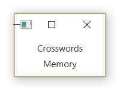
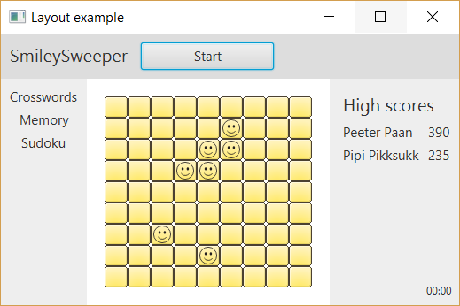

================
*JavaFX: Layout*
================

**Layout** konteinerid ehk paanid (*panes*) võimaldavad komponente (*scene graph*'i) sees erineval viisil paigutada. Soovitud struktuuri saamiseks võib erinevaid paane üksteise sisse panna. Kui akna suurust muudetakse, muudavad paanid automaatselt enda komponentide mõõtmeid ja paiknemist.

Paanidel on hulk erinevaid meetodeid, millega saab teha väikeseid muudatusi nende välimuses (laius, pikkus, vahe komponentide vahel jne) või lisada funktsioone, mis käivituvad erinevate sündmuste puhul. Mõningaid neist on mõnes järgnevas näites kasutatud, ning neid saab täpselt samamoodi kasutada kõigi paanide puhul ning tegelikult ka komponentide puhul, kuna need päritakse ühistelt ülemklassidelt **Node** ja **Region**.

*HBox, VBox*
============

**Hbox** ja **VBox** võimaldavad komponente paigutada üksteise kõrvale (*Hbox*) või üksteise alla (*VBox*).

.. code-block:: java

    Label sudokuLabel = new Label("Sudoku");
    Button startButton = new Button("Start");
    startButton.setPrefWidth(150);
    sudokuLabel.setFont(new Font("SegoeUI", 20));

    HBox hbox = new HBox();
    Hbox hbox = new HBox(sudokuLabel, startButton);

    hbox.setPadding(new Insets(10, 10, 10, 10));
    
    // Add some space between components
    hbox.setSpacing(15);

Kui me ei soovi *HBoxi* loomisel kohe komponente kaasa anda, võime hiljem pöörduda otse järglaste nimekirja poole, kasutades meetodit **getChildren**. Kuna tagastatakse *List*-tüüpi objekt, võime kasutada kõiki *List*'i meetodeid. **getChildren** meetod on olemas kõikidel paanidel.

.. code-block:: java

    // Add one at a time.
    hbox.getChildren().add(sudokuLabel);
    hbox.getChildren().add(startButton);
    
    // Add both at once.
    hbox.getChildren().addAll(sudokuLabel, startButton);

Tulemus:

.. image:: ../_images/hbox.png

.. code-block:: java

    Label crosswordsLabel = new Label("Crosswords");
    Label memoryLabel = new Label("Memory");
    crosswordsLabel.setFont(new Font("SegoeUI", 15));
    memoryLabel.setFont(new Font("SegoeUI", 15));

    VBox vbox = new VBox(crosswordsLabel, memoryLabel);

    vbox.setPadding(new Insets(10, 10, 10, 10));
    
    // Add a preferred width. This can change when the window is resized.
    vbox.setPrefWidth(150);
    vbox.setSpacing(5);

    vbox.setAlignment(Pos.CENTER);

Tulemus:

*GridPane*
==========

**GridPane** loob ruudustiku, mille ruutudesse komponente paigutatakse. Meetodi **setGridLinesVisible** abil saab kuvada abijooni, mis aitavad hinnata, kas ruudustiku abil üles ehitatud paigutus näeb korrektne välja.

.. code-block:: java

    Label highScoreLabel = new Label("High scores");
    highScoreLabel.setFont(new Font("SegoeUI", 20));

    GridPane gridPane = new GridPane();
    gridPane.setPadding(new Insets(10, 10, 10, 10));
    
    // Set different vertical and horizontal gaps between elements.
    gridPane.setVgap(5);
    gridPane.setHgap(10);

    gridPane.add(highScoreLabel, 0, 0, 2, 1);
    
    // Create a map of players and their scores
    HashMap<String, Integer> times = new HashMap<>();
    times.put("Peeter Paan", 390);
    times.put("Pipi Pikksukk", 235);
    
    // Add the scores to the grid as labels
    int row = 1;
    for (String name: times.keySet()) {
        gridPane.add(new Label(name), 0, row);
        String scoreString = times.get(name).toString();
        gridPane.add(new Label(scoreString), 1, row);
        row++;
    }

Tulemus, esimesel pildil on abijooned nähtavaks pandud:

.. image:: ../_images/gridpane.png

*FlowPane*
==========

**FlowPane** sarnaneb *Hbox*'i ja *VBox*'iga – ka seal paigutatakse elemente järjestikku kas horisontaalselt või vertikaalselt sõltuvalt paani orientatsioonist. Vahe on selles, et kui elemendid ei mahu kõik järjestikku, jätkab *FlowPane* nende paigutamist uuelt realt (või uuest veerust). Eelistatud tulpade või veergude arvu saab määrata meetodite **setPrefColumns** ja **setPrefRows** abil.

.. code-block:: java

    FlowPane flowPane = new FlowPane();
    
    // Set a width that's small enough to create an overflow of components
    flowPane.setPrefWidth(200);
    
    // Add two different types of images, 9 of both.
    for (int i = 0; i < 9; i++) {
        ImageView img = new ImageView(new Image(getClass().getResourceAsStream("smallyellowbox.png")));
        flowPane.getChildren().add(img);
        ImageView img2 = new ImageView(new Image(getClass().getResourceAsStream("bigredbox.png")));
        flowPane.getChildren().add(img2);
    }

Lisatud kujundid paigutatakse vahetult teineteise järgi ning ruumi täitumisel jätkatakse järgmiselt realt.

.. image:: ../_images/flow_pane.png

Vaikimisi on orientatsioon horisontaalne. Orientatsiooni muutmiseks saab kasutada meetodit **setOrientation**:

.. code-block:: java

    flowPane.setOrientation(Orientation.VERTICAL);

*TilePane*
==========

**TilePane** toimib samamoodi nagu *FlowPane*, kuid elemendid paigutatakse ruudustikku, kus kõik ruudud on võrdse suurusega. Ruudu suurus on vaikimisi suurima elemendi suurus, kuid seda saab eraldi määrata ka meetodite **setPrefTileWidth** ja **setPrefTileHeight** abil.

.. code-block:: java

    TilePane tilePane = new TilePane();
    tilePane.setPrefWidth(200);
    
    // Add same components as in the previous example
    for (int i = 0; i < 9; i++) {
        ImageView img = new ImageView(new Image(getClass().getResourceAsStream("smallyellowbox.png")));
        tilePane.getChildren().add(img);
        ImageView img2 = new ImageView(new Image(getClass().getResourceAsStream("bigredbox.png")));
        tilePane.getChildren().add(img2);
    }
    
    // Uncomment following lines to use bigger tiles
    // tilePane.setPrefTileWidth(50);
    // tilePane.setPrefTileHeight(50);

Koodi käivitamisel näeme, et on tekkinud väikesed vahed, kuna suur punane ristkülik on veidi laiem kui väike kollane. Kontrollimiseks võib lisada juurde ka teistsuguseid elemente, näiteks *Label*'eid.

.. image:: ../_images/tilepane.png

*StackPane*
===========

**StackPane** paigutab kõik komponendid üksteise peale. Nii on võimalik näiteks kujunditest ja tekstist kokku panna ikoone.

.. code-block:: java

    // Smiley icon
    ImageView icon = new ImageView(new Image(getClass().getResourceAsStream("icon.png")));
    
    // Use yellow box image as the background.
    ImageView iconBackground = new ImageView(new Image(getClass().getResourceAsStream("smallyellowbox.png")));

    StackPane stackPane = new StackPane();
    stackPane.setPadding(new Insets(10, 10, 10, 10));
    
    // Add background first because otherwise the smiley will be hidden underneath it
    stackPane.getChildren().addAll(iconBackground, icon);

Tulemus:

.. image:: ../_images/stackpane.png

*AnchorPane*
============

**AnchorPane** võimaldab komponente enda keskele, mõne serva või nurga külge ankurdada.

.. code-block:: java

    Label timeLabel = new Label("00:00");
    timeLabel.setFont(new Font("SegoeUI", 12));

    AnchorPane anchorPane = new AnchorPane();
    
    // Set a size big enough to notice the position of the anchored label
    anchorPane.setPrefSize(300, 200);
    anchorPane.getChildren().add(timeLabel);
    
    // Anchor label to the bottom right of the layout
    AnchorPane.setBottomAnchor(timeLabel, 8.0);
    AnchorPane.setRightAnchor(timeLabel, 8.0);

Akna suuruse muutmisel püsib Label alati alumises nurgas, kui aken on piisavalt suur, et teda ära mahutada.

.. image:: ../_images/anchor_pane.png

BorderPane
==========

**BorderPane** jaotab akna viieks piirkonnaks, kuhu komponente saab paigutada:

.. image:: ../_images/border_pane.png

Lisada võib nii komponente (*Label*, *Button* jne) kui ka paane.

.. code-block:: java

    BorderPane borderPane = new BorderPane();
    borderPane.setTop(new Label("Hello World");

Kasutame *BorderPane*'i, et ühendada mõned eelnevalt loodud paanid ühtseks kasutajaliideseks. Kõige alumise piirkonna jätame seekord kasutamata ning teeme mõned väiksed muudatused eelnevates näidetes. Iga paan luuakse eraldi meetodis, et kood oleks loetavam. *BorderPane* ise tehakse valmis  **start**-meetodis.

.. code-block:: java

    import javafx.application.Application;
    import javafx.event.ActionEvent;
    import javafx.geometry.Insets;
    import javafx.geometry.Pos;
    import javafx.scene.Group;
    import javafx.scene.Node;
    import javafx.scene.Scene;
    import javafx.scene.control.Button;
    import javafx.scene.control.Label;
    import javafx.scene.image.Image;
    import javafx.scene.image.ImageView;
    import javafx.scene.layout.*;
    import javafx.scene.text.Font;
    import javafx.stage.Stage;

    import java.util.HashMap;

    public class LayoutExample extends Application {
        public static void main(String[] args) {
            launch(args);
        }

        @Override
        public void start(Stage stage) throws Exception {
            stage.setTitle("Layout example");
            
            // Create the scene with a BorderPane layout.
            BorderPane borderPane = new BorderPane();
            Scene scene = new Scene(borderPane);
            
            // Create some panes.
            HBox header = createHBox();
            VBox sidebar = createVBox();
            TilePane tiles = createTilePane();
            AnchorPane footer = createAnchorPane();
            
            // Add panes to the BorderPane.
            borderPane.setTop(header);
            borderPane.setLeft(sidebar);
            borderPane.setCenter(tiles);
            borderPane.setRight(footer);

            stage.setScene(scene);
            stage.show();
        }

        private GridPane createGridPane() {
        
            // Create title label.
            Label highScoreLabel = new Label("High scores");
            highScoreLabel.setFont(new Font("SegoeUI", 20));
            
            // Create the grid pane.
            GridPane gridPane = new GridPane();
            gridPane.setPadding(new Insets(10, 10, 10, 10));
            gridPane.setVgap(5); // Vertical gap between components
            gridPane.setHgap(10); // Horizontal gap between components
            
            // Add the label to the grid.
            gridPane.add(highScoreLabel, 0, 0, 2, 1);
            
            // Create a map of players and their scores.
            HashMap<String, Integer> times = new HashMap<>();
            times.put("Peeter Paan", 390);
            times.put("Pipi Pikksukk", 235);
            
            // Add the scores to the grid as labels
            int row = 1;
            for (String name: times.keySet()) {
                gridPane.add(new Label(name), 0, row);
                String scoreString = times.get(name).toString();
                gridPane.add(new Label(scoreString), 1, row);
                row++;
            }
            
            // Uncomment next line for debugging purposes only.
            // gridPane.setGridLinesVisible(true);
            
            return gridPane;
        }

        private AnchorPane createAnchorPane() {
        
            // Create a label for showing the time passed since start.
            Label timeLabel = new Label("00:00");
            timeLabel.setFont(new Font("SegoeUI", 12));
            
            // Create a high score table.
            GridPane highscores = createGridPane();
            
            // Add the components to the pane.
            AnchorPane anchorPane = new AnchorPane();
            anchorPane.getChildren().addAll(timeLabel, highscores);
            
            // Change the background color of the pane.
            anchorPane.setStyle("-fx-background-color: #eeeeee;");
            
            // Add anchors to keep elements in place.
            AnchorPane.setLeftAnchor(highscores, 5.0);
            AnchorPane.setTopAnchor(highscores, 5.0);
            AnchorPane.setBottomAnchor(timeLabel, 8.0);
            AnchorPane.setRightAnchor(timeLabel, 8.0);

            return anchorPane;
        }

        private HBox createHBox() {
        
            // Create the title label and a start button.
            Label smileySweeperLabel = new Label("SmileySweeper");
            smileySweeperLabel.setFont(new Font("SegoeUI", 20));
            Button startButton = new Button("Start");
            startButton.setPrefWidth(150);
            
            // Create the HBox and add components.
            HBox hbox = new HBox();
            hbox.setStyle("-fx-background-color: #dddddd;");
            hbox.getChildren().addAll(smileySweeperLabel, startButton);
            
            // Add some padding and spacing for a better look.
            hbox.setPadding(new Insets(10, 10, 10, 10));
            hbox.setSpacing(15);

            return hbox;
        }

        private VBox createVBox() {
        
            // Create some labels with names of possible games.
            Label crosswordsLabel = new Label("Crosswords");
            Label memoryLabel = new Label("Memory");
            Label sudokuLabel = new Label("Sudoku");
            
            // Create vbox and add labels.
            VBox vbox = new VBox(crosswordsLabel, memoryLabel, sudokuLabel);
            vbox.setStyle("-fx-background-color: #eeeeee;");
            
            // Change font for all labels.
            Font gameLabelFont = new Font("SegoeUI", 15);
            for (Node child: vbox.getChildren()) {
                Label label = (Label) child;
                label.setFont(gameLabelFont);
            }
            
            // Add some space
            vbox.setPadding(new Insets(10, 10, 10, 10));
            vbox.setSpacing(5);
            
            // Position all children at the top center of the layout.
            vbox.setAlignment(Pos.TOP_CENTER);

            return vbox;
        }

        private TilePane createTilePane() {
            TilePane tilePane = new TilePane();
            
            // Create 9x9 tiles and add them to the pane.
            for (int i = 0; i < 81; i++) {
            
                // Use StackPanes as tiles
                StackPane tile = createStackPane();
                
                // If the tile is clicked, show or hide the smiley image.
                // The smiley is the second element in the StackPane.
                ImageView smiley = (ImageView) tile.getChildren().get(1);
                smiley.setVisible(false); // Hidden by default
                tile.setOnMouseClicked(e -> {
                    if (smiley.isVisible()) {
                        smiley.setVisible(false);
                    } else {
                        smiley.setVisible(true);
                    }
                });
                tilePane.getChildren().add(tile);
            }
            
            // Arrange them in a 9x9 grid in the center of its container.
            tilePane.setPrefColumns(9);
            tilePane.setPadding(new Insets(20, 20, 20, 20));

            return tilePane;
        }

        private StackPane createStackPane() {
        
            // Create the StackPane and some images.
            StackPane stackPane = new StackPane();
            ImageView icon = new ImageView(new Image(getClass().getResourceAsStream("icon.png")));
            ImageView iconBackground = new ImageView(new Image(getClass().getResourceAsStream("smallyellowbox.png")));
            
            // Add background first because otherwise the smiley will be hidden underneath it
            stackPane.getChildren().addAll(iconBackground, icon);

            return stackPane;
        }

    }

Tulemus:

Kuna me kasutasime näites ruudustiku loomiseks *TilePane*'i, muutub akna suuruse muutmisel ka ruudukeste paigutus. Reaalselt sellise mängu loomisel oleks *GridPane* mõistlikum valik.

Antud näites pole mängu ennast realiseeritud, põhirõhk on välimusel. Ruudukesed on tehtud *StackPane*'idena ning reageerivad vajutusele, et oleks võimalik demonstreerida üht *StackPane*'i kasutusvõimalust.
